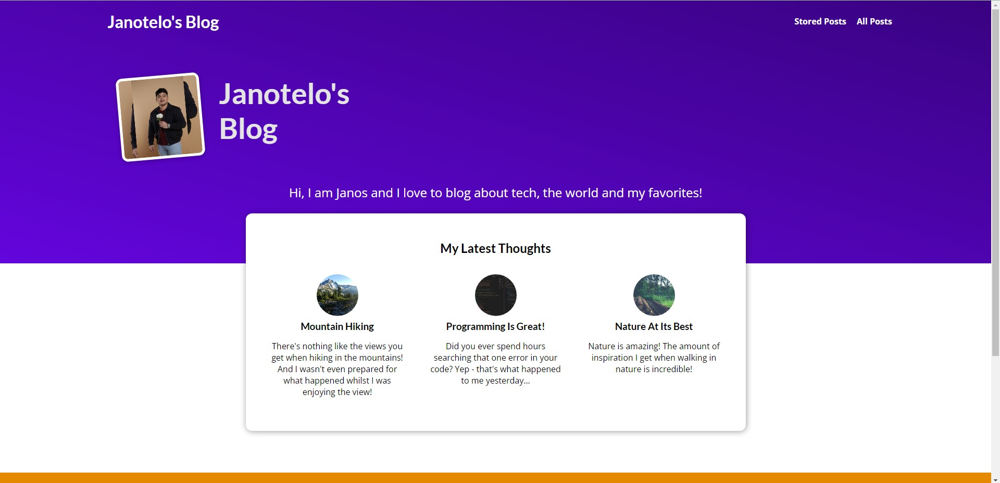

# MyBlog_WebDeployment
This is the base version of "my_site" django project that is deployed on AWS Elastic Beanstalk. There is a private repository of this project wherein the released package in server are using AWS S3 and RDS for serving the static files and PostgreSQL, respectively.  Below is the main page of the website:  

  
You can visit my website by clicking [here](http://django-blog3-env.eba-kjabuy9t.ap-southeast-2.elasticbeanstalk.com/).

### How to's
- To use Amazon Relational Database Service (RDS)
1. Create database with engine type of PostgreSQL. Use the latest version of PostgreSQL.
2. Use Free tier on the templates. This will automatically set the settings for free tier.
3. Create a master username and password for the database. This will be used on the django settings.
4. Make it to public access.
5. Finalize database and hit create database.
6. Setup of the settings of django project and then configure the environment variables in the elastic beanstalk (USER, PASSWORD, HOST and PORT)
7. Done.  
  
- To use Amazon S3
1. Create bucket, set the name of the bucket.
2. Uncheck "Block all public access"
3. Don't change any settings and then hit create bucket.
4. On the IAM Console Manager, create a new instance key.
5. Configure the settings of the django project initialized for using S3 (Inluding but not limited to url paths, extensions, etc.)
6. Include environemnt variables on the elastic beanstalk (STORAGE_BUCKET_NAME, S3_REGION_NAME, ACCESS_KEY_ID, SECRET_ACCESS_KEY)
7. Done.

### Other Pages | Images
*These are the initial images of the page. Changes on the deployed web might be seen.*  
1. All Post Page  

All posts can be seen in this page, unlike on the main page where only the latest post are seen.
2. Detailed Post Page

When you click a specific post, a detailed view of the post will be showed.
3. Adding comment | Detailed Post Page

You can add a comment on each post and your comment will be showed bellow the post.
4. Admin Page

This is for the admin wherein data can be managed, including the posts, comments, authors, and tags.